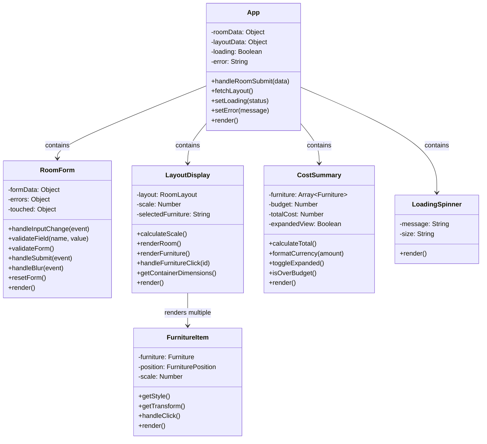
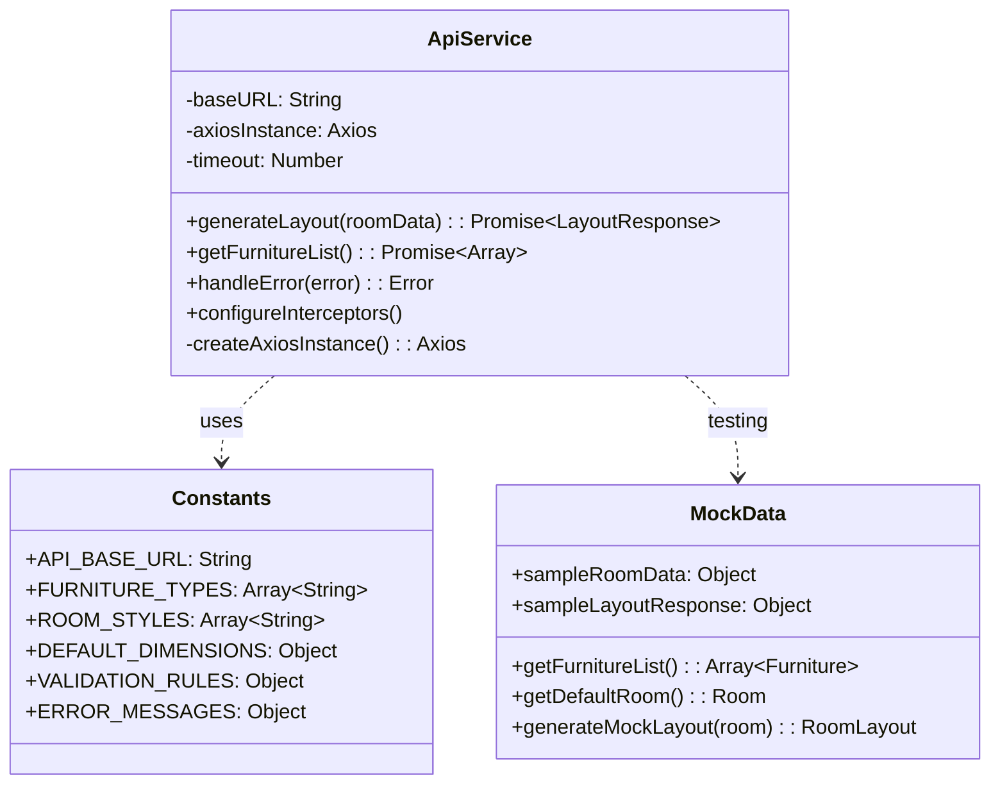
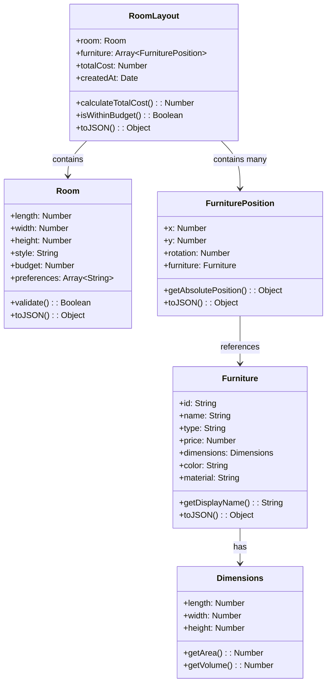
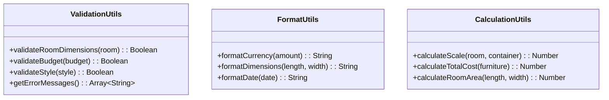
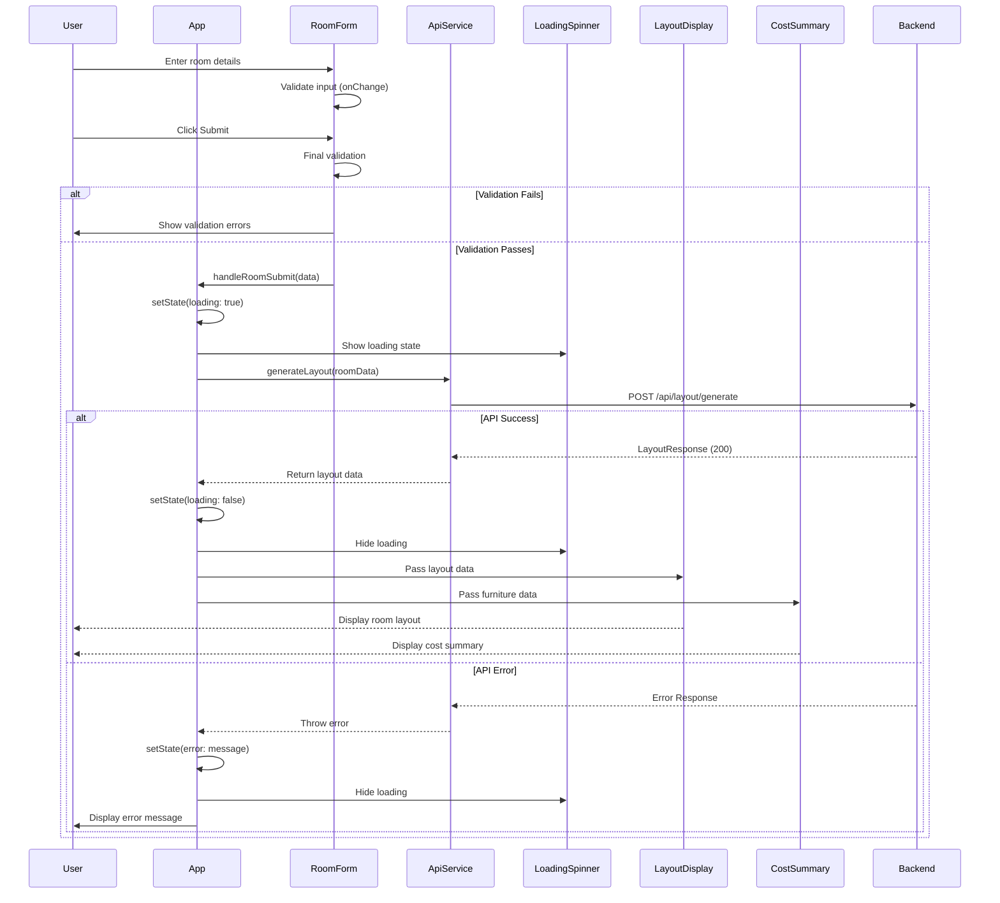
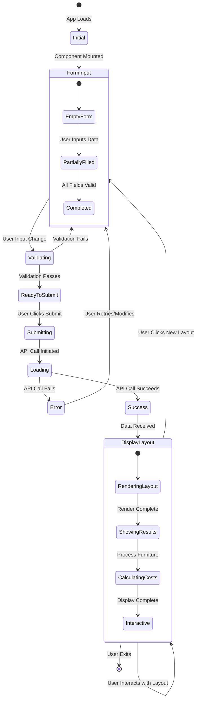
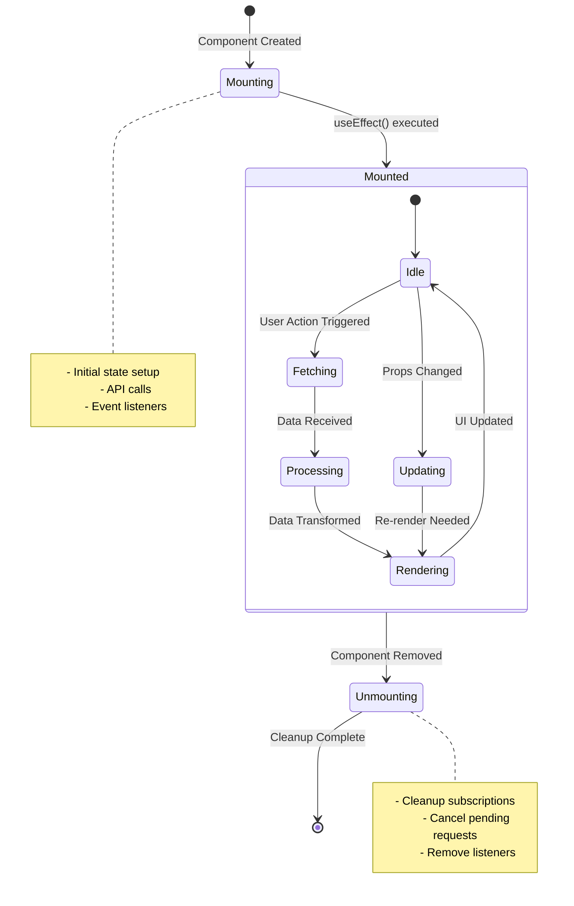
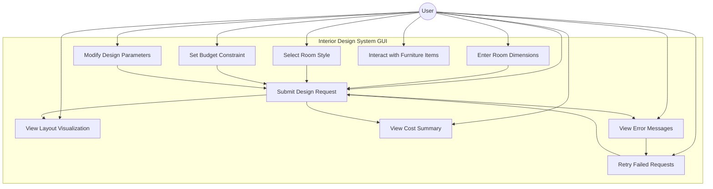
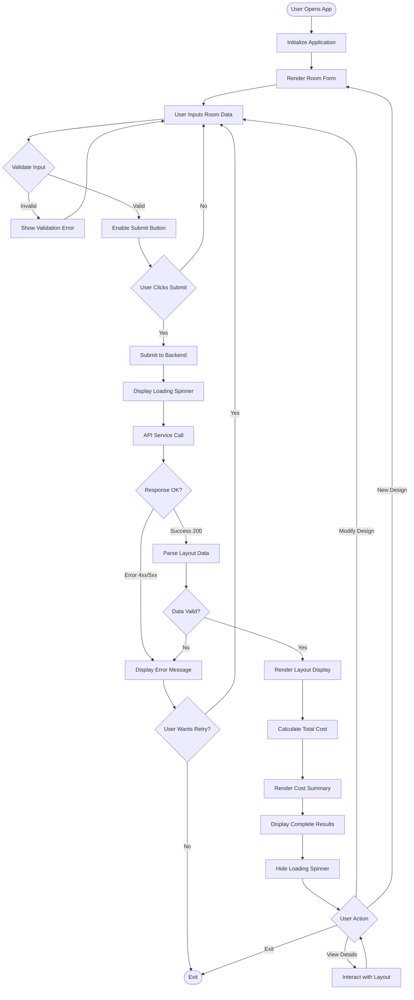
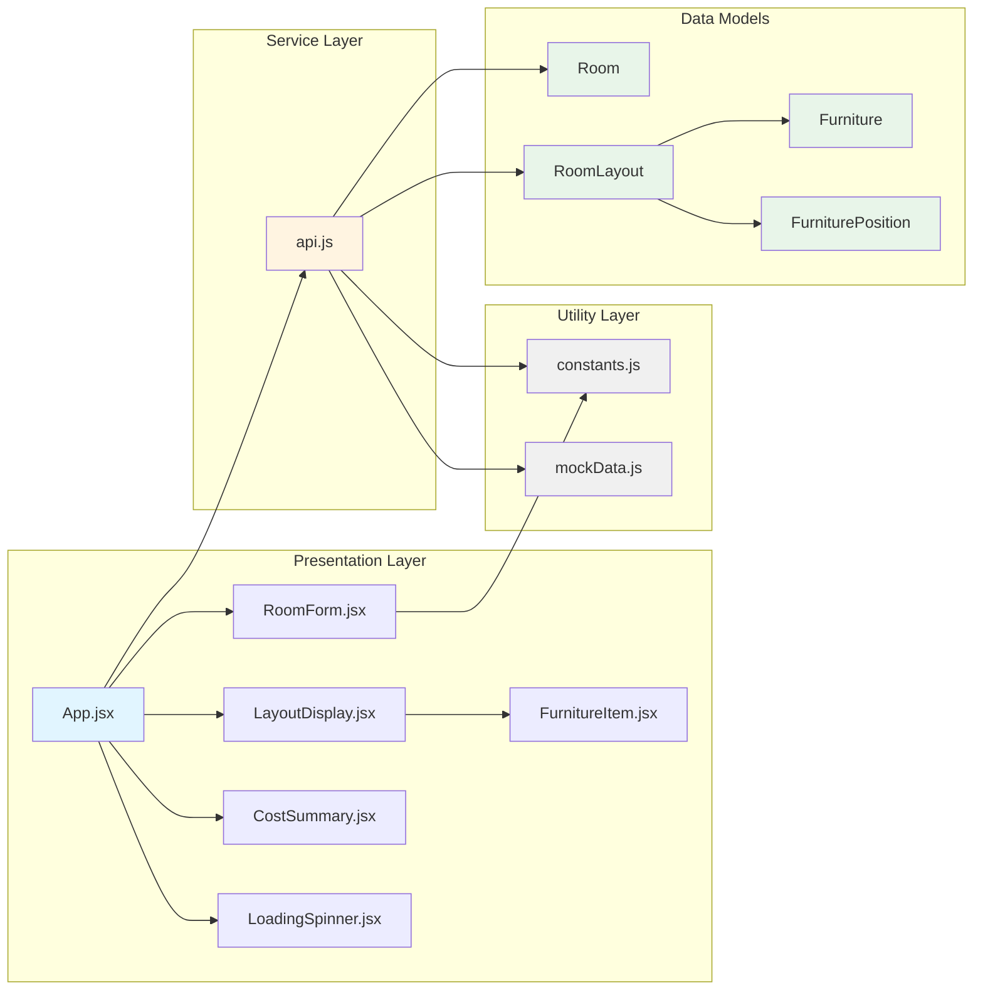

# GUI Implementation Documentation

## Table of Contents
1. [Introduction](#page-1-introduction)
2. [Technology Stack](#page-2-technology-stack)
3. [Class Diagrams](#page-3-class-diagrams)
4. [UML Diagrams](#page-4-uml-diagrams)
5. [Component Architecture](#page-5-component-architecture)

---

## Page 1: Introduction

### Overview
The Interior Design Application GUI is a modern, responsive web-based user interface built using React and Vite. The application provides users with an intuitive platform to design room layouts, select furniture, and visualize interior design solutions powered by AI.

### Purpose
This documentation provides a comprehensive overview of the GUI implementation, including:
- Frontend architecture and design patterns
- Component structure and relationships
- Technology stack and tools
- Visual representations through class and UML diagrams

### Key Features
1. **Interactive Room Design**: Users can input room dimensions and preferences
2. **AI-Powered Layout Generation**: Integration with backend AI services for intelligent furniture placement
3. **Real-time Visualization**: Dynamic display of room layouts and furniture positions
4. **Cost Calculation**: Automatic cost summary based on selected furniture
5. **Responsive Design**: Mobile-first approach using Tailwind CSS

### Application Structure
The GUI follows a component-based architecture with:
- **React Components**: Modular, reusable UI elements
- **Service Layer**: API communication and data handling
- **Utility Functions**: Helper functions and constants
- **State Management**: React hooks for component state

### User Workflow
```
1. User opens application
2. Fills room dimensions and preferences (RoomForm)
3. Submits design request
4. Loading state displays (LoadingSpinner)
5. AI processes layout through backend
6. Layout visualization appears (LayoutDisplay)
7. Cost summary calculated (CostSummary)
8. User can modify and regenerate layouts
```

### Target Audience
- End Users: Homeowners and interior design enthusiasts
- Developers: Frontend developers maintaining and extending the application
- Designers: UI/UX designers understanding the component structure

---

## Page 2: Technology Stack

### Frontend Framework
**React 18.x**
- Component-based UI library
- Virtual DOM for efficient rendering
- Hooks for state management (useState, useEffect)
- Fast development with hot module replacement
- Declarative programming paradigm

### Build Tool
**Vite 5.x**
- Lightning-fast build times
- ES modules support
- Hot Module Replacement (HMR)
- Optimized production builds
- Native TypeScript support
- Plugin ecosystem

### Styling Framework
**Tailwind CSS 3.x**
- Utility-first CSS framework
- Responsive design utilities
- Custom configuration support
- JIT (Just-In-Time) compiler
- Minimized production bundle
- Consistent design system

### HTTP Client
**Axios**
- Promise-based HTTP client
- Request/response interceptors
- Automatic JSON transformation
- Error handling utilities
- Request cancellation support

### Development Tools & Dependencies

```javascript
{
  "dependencies": {
    "react": "^18.x",
    "react-dom": "^18.x",
    "axios": "^1.x"
  },
  "devDependencies": {
    "vite": "^5.x",
    "tailwindcss": "^3.x",
    "postcss": "^8.x",
    "autoprefixer": "^10.x",
    "@vitejs/plugin-react": "^4.x"
  }
}
```

### Configuration Files

**vite.config.js**
- Vite bundler configuration
- Development server settings
- Build optimization rules
- Plugin configuration

**tailwind.config.js**
- Custom color schemes
- Typography settings
- Spacing customization
- Responsive breakpoints

**postcss.config.js**
- CSS processing pipeline
- Tailwind CSS integration
- Autoprefixer for browser compatibility

**package.json**
- Project metadata
- Dependency management
- Build and development scripts

### Core Technologies Summary

| Technology | Version | Purpose | Key Benefits |
|------------|---------|---------|--------------|
| React | 18.x | UI Framework | Component reusability, Virtual DOM |
| Vite | 5.x | Build Tool | Fast HMR, Optimized builds |
| Tailwind CSS | 3.x | Styling | Utility-first, Responsive design |
| Axios | 1.x | HTTP Client | Promise-based, Interceptors |
| PostCSS | 8.x | CSS Processing | Transformation, Optimization |

### Browser Compatibility
- **Chrome**: Latest 2 versions
- **Firefox**: Latest 2 versions
- **Safari**: Latest 2 versions
- **Edge**: Latest 2 versions
- **Requirements**: ES6+ JavaScript support, CSS Grid and Flexbox

### Development Environment
- **Node.js**: Version 16.x or higher
- **npm/yarn**: Package management
- **Git**: Version control
- **VS Code**: Recommended IDE

---

## Page 3: Class Diagrams

### Component Class Structure



### Service Layer Classes



### Data Model Classes



### Utility Classes



---

## Page 4: UML Diagrams

### Component Interaction Sequence Diagram



### State Management Flow Diagram



### Component Lifecycle Diagram



### Use Case Diagram



### Activity Diagram - Layout Generation Process



### Class Relationship Diagram



---

## Page 5: Component Architecture

### Application Architecture Overview

```
┌──────────────────────────────────────────────────────────────────┐
│                      App.jsx (Root Component)                     │
│  ┌────────────────────────────────────────────────────────────┐  │
│  │ Responsibilities:                                           │  │
│  │ - Global State Management (room, layout, loading, error)   │  │
│  │ - Route Coordination                                        │  │
│  │ - API Integration                                           │  │
│  │ - Error Boundary & Error Handling                          │  │
│  └────────────────────────────────────────────────────────────┘  │
└────────────┬─────────────────────────────────────────────────────┘
             │
      ┌──────┴──────────┬──────────────┐
      │                 │              │
┌─────▼─────┐    ┌──────▼──────┐  ┌───▼────────┐
│ Container │    │  Services   │  │  Utilities │
│Components │    │    Layer    │  │   Layer    │
└─────┬─────┘    └──────┬──────┘  └───┬────────┘
      │                 │              │
      │                 │              │
┌─────▼─────────────────▼──────────────▼───────────────────┐
│          Presentational Components                        │
├────────────┬──────────────┬────────────┬─────────────────┤
│  RoomForm  │LayoutDisplay │ CostSummary│ LoadingSpinner  │
│            │              │            │                 │
│            ├──────────────┤            │                 │
│            │FurnitureItem │            │                 │
└────────────┴──────────────┴────────────┴─────────────────┘
```

### Component Hierarchy Tree

```javascript
// Component Tree Structure with Props Flow
App
├── RoomForm
│   ├── Props: { onSubmit, initialData }
│   ├── State: { formData, errors, touched }
│   │
│   ├── Form Container (div)
│   │   ├── Title (h2)
│   │   │
│   │   ├── Input: Room Length
│   │   │   ├── Label
│   │   │   ├── Input Field
│   │   │   └── Error Message (conditional)
│   │   │
│   │   ├── Input: Room Width
│   │   │   ├── Label
│   │   │   ├── Input Field
│   │   │   └── Error Message (conditional)
│   │   │
│   │   ├── Input: Room Height
│   │   │   ├── Label
│   │   │   ├── Input Field
│   │   │   └── Error Message (conditional)
│   │   │
│   │   ├── Select: Room Style
│   │   │   ├── Label
│   │   │   ├── Dropdown
│   │   │   └── Error Message (conditional)
│   │   │
│   │   ├── Input: Budget
│   │   │   ├── Label
│   │   │   ├── Input Field
│   │   │   └── Error Message (conditional)
│   │   │
│   │   └── Submit Button
│   │       └── Button Text
│   │
│   └── Methods:
│       ├── handleInputChange()
│       ├── validateField()
│       ├── handleSubmit()
│       └── resetForm()
│
├── LoadingSpinner (Conditional Render)
│   ├── Props: { message }
│   ├── Spinner Animation (div)
│   └── Loading Message (p)
│
├── LayoutDisplay (Conditional Render)
│   ├── Props: { layout, onFurnitureClick }
│   ├── State: { scale, selectedFurniture }
│   │
│   ├── Layout Container (div)
│   │   ├── Room Title (h3)
│   │   ├── Room Dimensions Display
│   │   │
│   │   ├── Room Canvas (div)
│   │   │   ├── Room Boundary
│   │   │   │
│   │   │   └── FurnitureItem[] (Multiple instances)
│   │   │       ├── Props: { furniture, position, scale, onClick }
│   │   │       │
│   │   │       ├── Furniture Container (div)
│   │   │       │   ├── Furniture Icon/Image
│   │   │       │   ├── Furniture Name
│   │   │       │   └── Position Indicator
│   │   │       │
│   │   │       └── Hover Tooltip
│   │   │           ├── Furniture Details
│   │   │           ├── Dimensions
│   │   │           └── Price
│   │   │
│   │   └── Legend/Scale Indicator
│   │
│   └── Methods:
│       ├── calculateScale()
│       ├── renderRoom()
│       └── handleFurnitureClick()
│
└── CostSummary (Conditional Render)
    ├── Props: { furniture, budget }
    ├── State: { expandedView }
    │
    ├── Summary Container (div)
    │   ├── Summary Title (h3)
    │   │
    │   ├── Furniture List (ul)
    │   │   └── Furniture Items (li[])
    │   │       ├── Furniture Name
    │   │       ├── Quantity
    │   │       └── Price
    │   │
    │   ├── Divider (hr)
    │   │
    │   ├── Total Cost Display
    │   │   ├── Label
    │   │   └── Amount (formatted)
    │   │
    │   ├── Budget Comparison (conditional)
    │   │   ├── Budget Amount
    │   │   ├── Remaining/Over Budget
    │   │   └── Status Indicator
    │   │
    │   └── Expand/Collapse Button
    │
    └── Methods:
        ├── calculateTotal()
        ├── formatCurrency()
        └── toggleExpanded()
```

### Component Responsibilities Matrix

| Component | Primary Responsibility | Props | State | Side Effects |
|-----------|----------------------|-------|-------|--------------|
| **App.jsx** | Application orchestration | None | roomData, layoutData, loading, error | API calls, error handling |
| **RoomForm.jsx** | User input collection | onSubmit, initialData | formData, errors, touched | Form validation |
| **LayoutDisplay.jsx** | Layout visualization | layout, onFurnitureClick | scale, selectedFurniture | Canvas rendering, scaling |
| **FurnitureItem.jsx** | Individual furniture display | furniture, position, scale, onClick | None | Click handlers |
| **CostSummary.jsx** | Cost calculation & display | furniture, budget | expandedView | Cost calculations |
| **LoadingSpinner.jsx** | Loading state indication | message | None | None |

### Detailed Component Specifications

#### **App.jsx**
```javascript
Component: App (Root Container)

Responsibilities:
- Manage application-wide state
- Coordinate data flow between components
- Handle API integration via ApiService
- Manage loading and error states
- Render child components conditionally based on state
- Provide error boundaries

Props: None (Root component)

State:
{
  roomData: {
    length: Number,
    width: Number,
    height: Number,
    style: String,
    budget: Number
  } | null,
  
  layoutData: {
    room: Room,
    furniture: FurniturePosition[],
    totalCost: Number
  } | null,
  
  loading: Boolean,
  error: String | null
}

Methods:
- handleRoomSubmit(data): Process form submission
- fetchLayout(): Call API to generate layout
- setLoading(status): Update loading state
- setError(message): Update error state
- clearError(): Clear error message

Lifecycle:
- useEffect: Initialize application state
- useEffect: Handle error timeout/clearing

Render Logic:
- Always render RoomForm
- Conditionally render LoadingSpinner when loading
- Conditionally render LayoutDisplay when layoutData exists
- Conditionally render CostSummary when layoutData exists
- Conditionally render error messages
```

#### **RoomForm.jsx**
```javascript
Component: RoomForm (Controlled Form)

Responsibilities:
- Collect user input for room specifications
- Validate form data in real-time
- Handle form submission
- Display validation errors
- Provide user feedback

Props:
{
  onSubmit: Function(roomData) => void,
  initialData: Object | null (optional)
}

State:
{
  formData: {
    length: String,
    width: String,
    height: String,
    style: String,
    budget: String
  },
  
  errors: {
    length: String | null,
    width: String | null,
    height: String | null,
    style: String | null,
    budget: String | null
  },
  
  touched: {
    length: Boolean,
    width: Boolean,
    height: Boolean,
    style: Boolean,
    budget: Boolean
  }
}

Methods:
- handleInputChange(event): Update form field
- validateField(name, value): Validate single field
- validateForm(): Validate entire form
- handleSubmit(event): Process form submission
- handleBlur(event): Mark field as touched
- resetForm(): Clear form data

Validation Rules:
- length: Required, > 0, <= 100 (feet)
- width: Required, > 0, <= 100 (feet)
- height: Required, > 0, <= 20 (feet)
- style: Required, from predefined list
- budget: Optional, >= 0

Events:
- onChange: Real-time validation
- onBlur: Mark field as touched
- onSubmit: Form submission
```

#### **LayoutDisplay.jsx**
```javascript
Component: LayoutDisplay (Canvas Visualization)

Responsibilities:
- Render room layout visualization
- Position furniture items accurately
- Handle scaling for responsive display
- Show room dimensions
- Enable furniture interaction
- Display grid/measurements

Props:
{
  layout: {
    room: Room,
    furniture: FurniturePosition[]
  },
  onFurnitureClick: Function(furnitureId) => void (optional)
}

State:
{
  scale: Number (calculated scale factor),
  selectedFurniture: String | null (furniture ID)
}

Methods:
- calculateScale(): Determine scaling factor based on container
- renderRoom(): Draw room boundaries
- renderFurniture(): Position all furniture items
- handleFurnitureClick(id): Handle furniture selection
- getContainerDimensions(): Get available display space

Calculations:
- scale = MIN(containerWidth / roomWidth, containerHeight / roomLength)
- furnitureX = positionX * scale
- furnitureY = positionY * scale

CSS Classes:
- layout-container: Main container
- room-canvas: Canvas area
- room-boundary: Room outline
- furniture-layer: Furniture positioning layer
```

#### **FurnitureItem.jsx**
```javascript
Component: FurnitureItem (Presentational)

Responsibilities:
- Display individual furniture piece
- Show furniture position and rotation
- Render furniture details on hover
- Handle furniture interactions
- Apply proper styling and transforms

Props:
{
  furniture: {
    id: String,
    name: String,
    type: String,
    price: Number,
    dimensions: { length, width, height }
  },
  position: {
    x: Number,
    y: Number,
    rotation: Number
  },
  scale: Number,
  onClick: Function(furnitureId) => void (optional)
}

State: None (Stateless/Pure Component)

Methods:
- getStyle(): Calculate inline styles
- getTransform(): Calculate CSS transform
- handleClick(): Trigger onClick callback

Style Calculations:
- left: position.x * scale + 'px'
- top: position.y * scale + 'px'
- width: furniture.dimensions.width * scale + 'px'
- height: furniture.dimensions.length * scale + 'px'
- transform: `rotate(${position.rotation}deg)`

Visual Elements:
- Furniture icon/representation
- Furniture name label
- Hover tooltip with details
- Selection indicator (if selected)
```

#### **CostSummary.jsx**
```javascript
Component: CostSummary (Calculation & Display)

Responsibilities:
- Calculate total cost of furniture
- Display itemized furniture costs
- Show budget comparison
- Format currency values
- Provide expandable detailed view

Props:
{
  furniture: Array<Furniture>,
  budget: Number | null (optional)
}

State:
{
  expandedView: Boolean (default: false)
}

Methods:
- calculateTotal(): Sum all furniture costs
- formatCurrency(amount): Format as USD
- toggleExpanded(): Toggle detail view
- isOverBudget(): Check budget constraint
- groupFurnitureByType(): Organize furniture

Calculations:
- totalCost = furniture.reduce((sum, item) => sum + item.price, 0)
- remaining = budget - totalCost
- percentUsed = (totalCost / budget) * 100

Display Elements:
- Furniture list with prices
- Subtotal per category
- Total cost (prominent)
- Budget status (if budget provided)
- Over/Under budget indicator
```

#### **LoadingSpinner.jsx**
```javascript
Component: LoadingSpinner (UI Feedback)

Responsibilities:
- Display loading animation
- Show contextual loading message
- Provide visual feedback during async operations
- Accessible loading state

Props:
{
  message: String (optional, default: "Loading...")
}

State: None (Stateless)

Visual Elements:
- Animated spinner (CSS animation)
- Loading message text
- Semi-transparent overlay (optional)

CSS Animation:
- Rotating circular spinner
- Smooth animation (1s linear infinite)
- Accessible (respects prefers-reduced-motion)
```

### Service Layer Architecture

#### **api.js (ApiService)**
```javascript
Service: ApiService
Purpose: Handle all HTTP communications with backend

Configuration:
{
  baseURL: process.env.VITE_API_BASE_URL || 'http://localhost:8080',
  timeout: 30000,
  headers: {
    'Content-Type': 'application/json'
  }
}

Methods:

1. generateLayout(roomData)
   - Endpoint: POST /api/layout/generate
   - Input: { length, width, height, style, budget }
   - Output: Promise<LayoutResponse>
   - Error Handling: Catch and transform errors

2. getFurnitureList()
   - Endpoint: GET /api/furniture
   - Output: Promise<Array<Furniture>>
   - Caching: Optional client-side cache

3. handleError(error)
   - Transform Axios errors to user-friendly messages
   - Log errors for debugging
   - Return structured error object

Interceptors:
- Request: Add authentication tokens (if needed)
- Response: Handle common errors (401, 403, 500)

Error Types:
- Network Error: Connection issues
- Timeout Error: Request took too long
- Validation Error: Invalid input data
- Server Error: Backend processing error
```

### Data Flow Architecture

```
┌──────────────────────────────────────────────────────────────┐
│                        User Interaction                       │
└───────────────────────────┬──────────────────────────────────┘
                            │
                            ▼
┌──────────────────────────────────────────────────────────────┐
│  (1) INPUT: RoomForm Component                                │
│      - Collect room dimensions                                │
│      - Validate input fields                                  │
│      - Emit validated data                                    │
└───────────────────────┬──────────────────────────────────────┘
                        │ handleRoomSubmit(roomData)
                        ▼
┌──────────────────────────────────────────────────────────────┐
│  (2) PROCESSING: App Component                                │
│      - Update state: loading = true                           │
│      - Store room data                                        │
│      - Trigger API call                                       │
└───────────────────────┬──────────────────────────────────────┘
                        │ generateLayout(roomData)
                        ▼
┌──────────────────────────────────────────────────────────────┐
│  (3) API LAYER: ApiService                                    │
│      - Format request payload                                 │
│      - Send HTTP POST request                                 │
│      - Handle response/errors                                 │
└───────────────────────┬──────────────────────────────────────┘
                        │ HTTP Request
                        ▼
┌──────────────────────────────────────────────────────────────┐
│  (4) BACKEND: Spring Boot Application                        │
│      - Process room data                                      │
│      - Generate layout via AI                                 │
│      - Return layout response                                 │
└───────────────────────┬──────────────────────────────────────┘
                        │ LayoutResponse
                        ▼
┌──────────────────────────────────────────────────────────────┐
│  (5) RESPONSE HANDLING: ApiService                            │
│      - Parse JSON response                                    │
│      - Transform to frontend models                           │
│      - Return Promise                                         │
└───────────────────────┬──────────────────────────────────────┘
                        │ Promise.resolve(layoutData)
                        ▼
┌──────────────────────────────────────────────────────────────┐
│  (6) STATE UPDATE: App Component                              │
│      - Update state: loading = false                          │
│      - Store layout data                                      │
│      - Clear any errors                                       │
└───────────────────────┬──────────────────────────────────────┘
                        │
            ┌───────────┴───────────┐
            │                       │
            ▼                       ▼
┌─────────────────────┐   ┌─────────────────────┐
│  (7a) RENDER:       │   │  (7b) RENDER:       │
│  LayoutDisplay      │   │  CostSummary        │
│  - Receive layout   │   │  - Receive furniture│
│  - Calculate scale  │   │  - Calculate costs  │
│  - Render room      │   │  - Display summary  │
│  - Position items   │   │  - Show budget      │
└──────────┬──────────┘   └──────────┬──────────┘
           │                         │
           └────────────┬────────────┘
                        │
                        ▼
┌──────────────────────────────────────────────────────────────┐
│                    (8) USER SEES RESULT                       │
│      - Visual layout displayed                                │
│      - Cost information shown                                 │
│      - Can interact with elements                             │
└──────────────────────────────────────────────────────────────┘
```

### Styling Architecture

```
Tailwind CSS Utility-First Approach
│
├── Base Layer (index.css)
│   ├── @tailwind base
│   ├── CSS Reset/Normalize
│   └── Custom base styles
│
├── Components Layer
│   ├── @tailwind components
│   └── Custom component classes
│       ├── .btn-primary
│       ├── .input-field
│       └── .card-container
│
├── Utilities Layer
│   ├── @tailwind utilities
│   └── Custom utility classes
│
└── Configuration (tailwind.config.js)
    ├── Theme Customization
    │   ├── colors: { primary, secondary, accent }
    │   ├── spacing: { custom spacing scale }
    │   ├── fontFamily: { sans, serif, mono }
    │   └── borderRadius: { custom radii }
    │
    ├── Responsive Breakpoints
    │   ├── sm: '640px'   (Mobile landscape)
    │   ├── md: '768px'   (Tablet)
    │   ├── lg: '1024px'  (Desktop)
    │   └── xl: '1280px'  (Large desktop)
    │
    └── Plugins
        ├── @tailwindcss/forms
        └── Custom plugins

Component-Level Styling Strategy:
├── Utility Classes (Primary)
│   └── className="flex items-center justify-between p-4 bg-blue-500"
│
├── Responsive Utilities
│   └── className="w-full md:w-1/2 lg:w-1/3"
│
├── State Variants
│   └── className="hover:bg-blue-600 focus:ring-2 disabled:opacity-50"
│
└── Custom Components (When Needed)
    └── className="btn-primary card-shadow"
```

### File Structure & Organization

```
APP-PROJECT/
│
├── index.html                    # Entry HTML file
├── package.json                  # Dependencies & scripts
├── vite.config.js               # Vite configuration
├── tailwind.config.js           # Tailwind customization
├── postcss.config.js            # PostCSS configuration
│
├── src/                         # Source code directory
│   │
│   ├── main.jsx                 # Application entry point
│   │   ├── Import React & ReactDOM
│   │   ├── Import App component
│   │   ├── Import global styles
│   │   └── Render App to DOM
│   │
│   ├── App.jsx                  # Root component
│   │   ├── State management
│   │   ├── API integration
│   │   ├── Component composition
│   │   └── Error handling
│   │
│   ├── index.css                # Global styles
│   │   ├── Tailwind directives
│   │   ├── Custom CSS variables
│   │   └── Global resets
│   │
│   ├── components/              # React components
│   │   ├── RoomForm.jsx         # Room input form
│   │   ├── LayoutDisplay.jsx    # Layout visualization
│   │   ├── FurnitureItem.jsx    # Individual furniture
│   │   ├── CostSummary.jsx      # Cost calculation
│   │   └── LoadingSpinner.jsx   # Loading indicator
│   │
│   ├── services/                # Business logic layer
│   │   └── api.js               # API communication
│   │       ├── Axios instance
│   │       ├── API methods
│   │       └── Error handling
│   │
│   └── utils/                   # Helper utilities
│       ├── constants.js         # App constants
│       │   ├── API endpoints
│       │   ├── Validation rules
│       │   └── Default values
│       │
│       └── mockData.js          # Mock/test data
│           ├── Sample rooms
│           ├── Sample layouts
│           └── Sample furniture
│
└── backend/                     # Backend (Spring Boot)
    └── [Backend structure - separate documentation]
```

### Component Communication Patterns

```javascript
// 1. Parent to Child (Props)
// App.jsx → RoomForm.jsx
<RoomForm 
  onSubmit={handleRoomSubmit}
  initialData={roomData}
/>

// 2. Child to Parent (Callbacks)
// RoomForm.jsx → App.jsx
const handleSubmit = (e) => {
  e.preventDefault();
  props.onSubmit(formData); // Send data up
};

// 3. Sibling Communication (Lifted State)
// LayoutDisplay ← App → CostSummary
// Both receive layoutData from App's state

// 4. Service Layer (Centralized)
// Any Component → ApiService → Backend
import { generateLayout } from './services/api';
const layout = await generateLayout(roomData);
```

### Performance Optimization Strategies

1. **Component Memoization**
   - Use `React.memo()` for FurnitureItem (pure component)
   - Prevent unnecessary re-renders

2. **Lazy Loading**
   - Code splitting for larger components
   - Dynamic imports for heavy dependencies

3. **Debouncing**
   - Debounce form validation
   - Throttle resize events in LayoutDisplay

4. **Efficient Rendering**
   - Use keys for list items
   - Avoid inline function definitions
   - Minimize state updates

5. **Asset Optimization**
   - Optimize images (furniture icons)
   - Use SVGs for icons
   - Lazy load images

### Error Handling Strategy

```javascript
// Error Boundaries (Component Level)
App.jsx
├── Try-Catch for API calls
├── Error state management
└── User-friendly error messages

// Error Types Handled:
1. Validation Errors
   - Display inline in RoomForm
   - Prevent form submission

2. Network Errors
   - Show retry option
   - Display connection message

3. API Errors
   - Parse error responses
   - Show specific error messages

4. Runtime Errors
   - Error boundary catch
   - Fallback UI display
```

### Testing Strategy (Recommended)

```javascript
// Unit Tests (Components)
- RoomForm: Input validation, submission
- LayoutDisplay: Scaling calculations
- CostSummary: Cost calculations
- ApiService: Request formatting

// Integration Tests
- Form submission → API call → Layout display
- Error handling flows
- State management

// E2E Tests
- Complete user workflow
- Layout generation process
- Error scenarios
```

---

## Conclusion

### Summary
This comprehensive GUI documentation covers all aspects of the Interior Design Application's frontend implementation, including:

✅ **Introduction**: Overview of the application, features, and user workflow  
✅ **Technology Stack**: Detailed breakdown of React, Vite, Tailwind CSS, and supporting tools  
✅ **Class Diagrams**: Visual representation of component structure and relationships  
✅ **UML Diagrams**: Sequence diagrams, state diagrams, use cases, and activity flows  
✅ **Component Architecture**: Detailed specifications, data flow, and implementation patterns

### Key Architectural Highlights

1. **Component-Based Design**: Modular, reusable components with clear separation of concerns
2. **Unidirectional Data Flow**: Props down, callbacks up pattern for predictable state management
3. **Service Layer Abstraction**: Clean API integration separate from UI components
4. **Responsive Design**: Mobile-first approach with Tailwind CSS utilities
5. **Error Handling**: Comprehensive error management at multiple levels

### Technology Benefits

- **React**: Fast, efficient rendering with virtual DOM
- **Vite**: Lightning-fast development with HMR
- **Tailwind CSS**: Consistent, maintainable styling
- **Axios**: Robust HTTP client with interceptors

### Maintainability Features

- Clear component responsibilities
- Consistent coding patterns
- Comprehensive documentation
- Scalable architecture
- Easy to test and debug

### Future Enhancement Possibilities

1. Add state management library (Redux/Zustand) for complex state
2. Implement authentication and user accounts
3. Add drag-and-drop furniture repositioning
4. Integrate 3D visualization
5. Add save/load layout functionality
6. Implement collaborative design features

### Documentation Maintenance

This documentation should be updated when:
- New components are added
- Component interfaces change
- New features are implemented
- Technology stack is updated
- Architecture patterns evolve

---

**Document Version**: 1.0  
**Last Updated**: October 16, 2025  
**Maintained By**: Development Team  
**Project**: Interior Design Application - GUI Implementation
