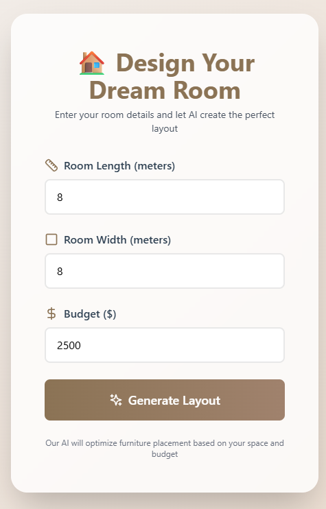
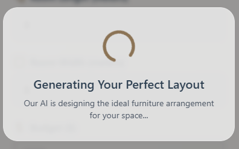

# 🏠 Interior Design Room Layout Planner

A modern full-stack application that uses AI to generate intelligent furniture layouts for interior design planning. Built with React frontend and Spring Boot backend, featuring a beautiful glassmorphism UI with real-time budget tracking and interactive floor plan visualization.

   

## 📋 Requirements

### Frontend
- Node.js 16+ and npm
- Modern web browser (Chrome, Firefox, Edge, Safari)

### Backend
- Java 17 or higher
- Maven 3.6+
- Spring Boot 3.2+
- OpenRouter API key (for AI layout generation)

## 🚀 Steps to Run the Program

### 1. Backend Setup

```bash
# Navigate to backend directory
cd backend

# Configure OpenRouter API key
# Edit src/main/resources/application.properties and add:
# openrouter.api.key=your_api_key_here

# Build the project
mvn clean install

# Run the Spring Boot application
mvn spring-boot:run
```

The backend will start on `http://localhost:8080`

### 2. Frontend Setup

```bash
# Navigate to project root directory
cd APP-PROJECT

# Install dependencies
npm install

# Start the development server
npm run dev
```

The frontend will start on `http://localhost:3000`

### 3. Using the Application

1. Open your browser and navigate to `http://localhost:3000`
2. Enter room dimensions (length and width in meters)
3. Set your budget (in dollars)
4. Click "Generate Layout" to get AI-powered furniture placement
5. View the interactive floor plan and cost breakdown
6. Click "Design Another Room" to start over

## 📸 Screenshots

### Main Interface


### Floor Plan


### Room Layout Generation


### Budget Summary


### Furniture Details


### Room Layout


---

Built with ❤️ using React, Spring Boot, and AI
